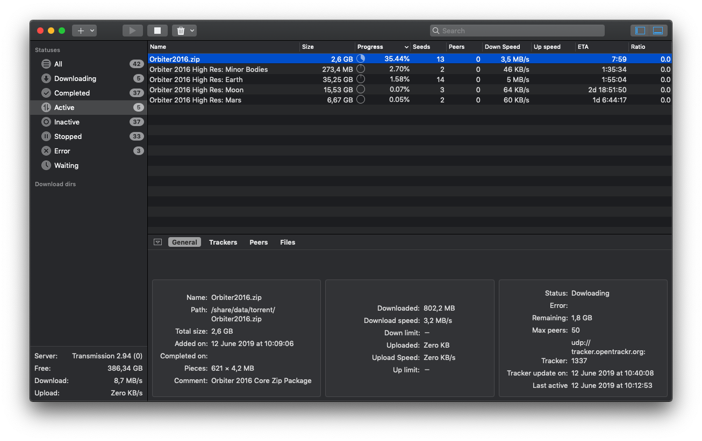

# TransmissionRemote



## Motivation

TransmissionRemote is the macOS client for transmission daemon. It is heavily inspired by [Transmission Remote GUI](https://github.com/transmission-remote-gui/transgui), which is fast and has all necessary functionality. Unfortunately, its macOS version uses really outdated technologies and lacks some native system features like dark mode support. But even more important, Transmission Remote GUI is 32bit (can't be changed), and therefore it won't work on 10.15+ at all. So, I decided to write a native transmission remote client. For now it has just a small set of essential features, but more will be added over time.

## Requirements

TransmissionRemote supports macOS Sierra (10.12) and higher. For building from source you'll need at least Xcode 10 on macOS High Sierra (10.13)

## Installation

Just grab the [app](https://github.com/selim-mustafaev/TransmissionRemote/releases/latest) from Releases section, and unzip it in /Applications folder (or wherever else you want)

## Building from source

Download source and build dependencies:

```bash
$ git clone https://github.com/selim-mustafaev/TransmissionRemote.git
$ cd TransmissionRemote
$ carthage bootstrap --platform macOS --no-use-binaries
```

Then just open `TransmissionRemote.xcodeproj` file in Xcode and you are ready to go.

## License

[MIT](LICENSE)
